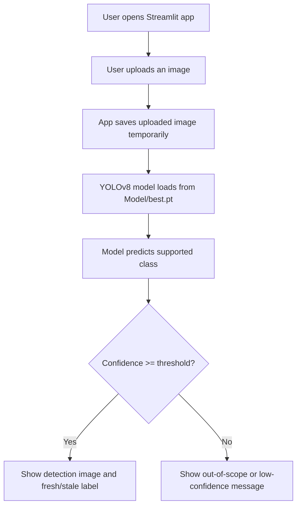

# Fresh and Stale Classifier

Fresh and Stale Classifier is a YOLOv8-based computer vision project that detects selected fruits and vegetables and classifies them as fresh or stale. The project includes a Streamlit web app for uploading an image and viewing the detection result.

## Problem Statement

In homes, shops, and small food businesses, it is often difficult to quickly judge the freshness of fruits and vegetables in a consistent way. Manual checking can be subjective, time-consuming, and different from person to person.

This project aims to build a simple image-based system that can help identify whether a supported fruit or vegetable is fresh or stale.

## Proposed Solution

This project uses a custom-trained YOLOv8 model to:

- detect supported fruits and vegetables in an image
- classify them as fresh or stale
- display the prediction result with bounding boxes
- show an out-of-scope message for unsupported or low-confidence inputs

## Supported Classes

The current model supports these 12 classes:

- `fresh_apple`
- `stale_apple`
- `fresh_banana`
- `stale_banana`
- `fresh_capsicum`
- `stale_capsicum`
- `fresh_tomato`
- `stale_tomato`
- `fresh_orange`
- `stale_orange`
- `fresh_bitter_gourd`
- `stale_bitter_gourd`

## Project Workflow Diagram



## Working Flow

1. The user uploads an image in the Streamlit app.
2. The app passes the image to the trained YOLOv8 model.
3. The model predicts whether the object belongs to one of the supported classes.
4. If the prediction confidence is high enough, the app shows the result image and label.
5. If confidence is low, the app shows the input as unsupported or out of model scope.

## Web App Link

Add your deployed app link here after deployment:

`Web App URL: paste-your-link-here`

## Repository Structure

```text
Fresh-or-Stale-Detector-main/
├── app.py
├── README.md
├── .gitignore
├── Model/
│   └── best.pt
├── Model_Train/
│   └── Detect.ipynb
├── Test_codes/
│   ├── detect_fresh_apple.py
│   └── detect_stale_tomato.py
└── Sample_Result/
    ├── fresh_apple_result.PNG
    └── stale_tomato_result.PNG
```

## Technologies Used

- Python
- YOLOv8
- Ultralytics
- Streamlit
- Pillow
- Google Colab

## How to Run the Project

1. Install dependencies:

```bash
pip install streamlit ultralytics pillow
```

2. Run the Streamlit app:

```bash
streamlit run app.py
```

3. Upload an image and view the result in your browser.

## Key Features

- Streamlit-based user interface
- Image upload for testing
- Fresh/stale classification for supported classes
- Detection result with bounding boxes
- Low-confidence filtering for unsupported images

## Limitations

- The model supports only apple, banana, capsicum, tomato, orange, and bitter gourd.
- The model does not contain a true `unknown` or `out_of_bound` training class.
- Unsupported images may still resemble known classes internally, so confidence filtering is used as a practical safeguard.
- Final accuracy depends on the quality and variety of the training dataset.

## Future Improvements

- Add an `unknown` or `out_of_bound` class during training
- Support more fruits and vegetables
- Improve accuracy with a larger dataset
- Deploy the project online for public use

## Sample Output

Sample result images are available in:

- [fresh_apple_result.PNG](/Users/apple/Fresh-or-Stale-Detector-main/Sample_Result/fresh_apple_result.PNG)
- [stale_tomato_result.PNG](/Users/apple/Fresh-or-Stale-Detector-main/Sample_Result/stale_tomato_result.PNG)

## Author

Soumyajit
